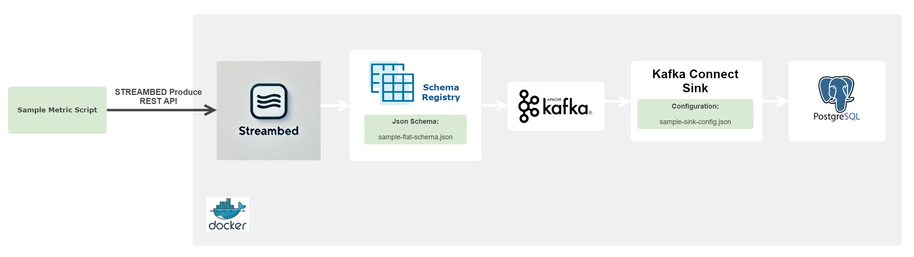
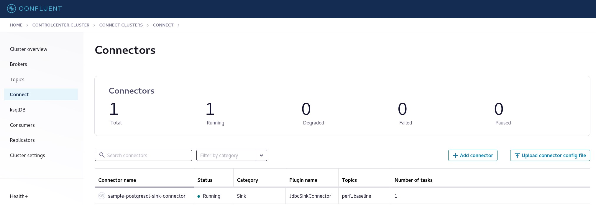

# Sample Flat Schema Metric

## Overview
This project demonstrates how to create a flat schema metric, register the schema in the schema registry, and produce messages to Kafka. The messages are then consumed by a Kafka Connect Sink and stored in a PostgreSQL database.

## Architecture


### schema registry
export SCHEMAHOST=localhost
#### Register Schema
```sh
curl -X 'POST' \
  "http://${SCHEMAHOST}:8082/v1/metrics/schema" \
  -H 'accept: application/json' \
  -H 'Content-Type: application/json' \
  -d '{
  "metric-name": "sample_flat_schema_metric",
  "schema": '"$(cat schema/sample-flat-schema.json)"',
  "schema-type": "JSON"
}'
```

#### Query Schema
```sh
curl -X 'GET' \
  "http://${SCHEMAHOST}:8082/v1/metrics/schema" \
  -H 'accept: application/json' \
  -H 'Content-Type: application/json' \
  -d '{
  "metric-name": "sample_flat_schema_metric"
}'
```

#### (Optional) Delete Schema
```sh
curl -X 'DELETE' \
  "http://${SCHEMAHOST}:8082/v1/metrics/schema" \
  -H 'accept: application/json' \
  -H 'Content-Type: application/json' \
  -d '{
  "metric-name": "sample_flat_schema_metric"
}'
```
### Kafka Connect Sink to PostgreSQL
#### Create Kafka Connect Sink
```sh
docker exec -it kafka-connect bash
curl -X POST -H "Content-Type: application/json" --data @/sample-flat-schema-metric-config/sample-sink-config.json http://localhost:8083/connectors
```
#### View the Metric Topic in Kafka Confluent Control Center
Navigate to http://{KAFKAHOST}:9021/ in your browser.


#### Query Kafka Connect Sink
```sh
docker exec -it kafka-connect bash
curl -X GET http://localhost:8083/connectors/sample-postgresql-sink-connector
```

#### (Optional) Delete Kafka Connect Sink
```sh
docker exec -it kafka-connect bash
curl -X DELETE http://localhost:8083/connectors/sample-postgresql-sink-connector
```

### Produce Messages to Kafka
```sh
source /nfs/projects/equinox/streambed/tools/streambed-venv/bin/activate
python src/sample-metric-producer.py --sb_host "$SCHEMAHOST" --yaml_file config/sample-streambed-config.yaml --num_msg 1
```
#### (Optional) Consume Messages from Kafka
```sh
source /nfs/projects/equinox/streambed/tools/streambed-venv/bin/activate
export KAFKAHOST=localhost
python /nfs/projects/equinox/streambed/git/marc-proto/streambed/src/streambed/utils/kafka/json-consumer.py "$KAFKAHOST" config/sample-streambed-config.yaml
```

### PostgreSQL
```sh
docker exec -it postgres psql -U postgres -d perf_server_database
\dt
SELECT * FROM sample_flat_schema_metric;
DROP TABLE sample_flat_schema_metric;
```

### Baseline comparison
```sh
curl -X 'POST' \
  "http://${SCHEMAHOST}:8082/v1/operations/baseline-compare" \
  -H 'accept: application/json' \
  -H 'Content-Type: application/json' \
  -d '{
  "metric-name": "sample_flat_schema_metric",
  "database-config": {
    "hostname": "postgres",
    "database-type": "postgresql",
    "database-name": "perf_server_database",
    "database-table-name": "sample_flat_schema_metric",
    "db-username": "postgres",
    "db-password": "postgres"
  },
  "algorithm": "effect-size",
  "context-a": {
    "load": "ee-109",
    "shelf": "1145",
    "captive": "performance-gls",
    "release": "030300"
  },
  "context-b": {
    "load": "er-122",
    "shelf": "1145",
    "captive": "performance-gls",
    "release": "030300"
  },
  "metric": [
    "process-time"
  ],
  "filter-on": {
    "operation": "add",
    "num-channels-before": 0,
    "num-channels-after": 64
  }
}'
```

### Health check
```sh
curl -X 'POST' \
  "http://${SCHEMAHOST}:8082/v1/operations/baseline-health-check" \
  -H 'accept: application/json' \
  -H 'Content-Type: application/json' \
  -d '{
  "metric-name": "sample_flat_schema_metric",
  "database-config": {
    "hostname": "postgres",
    "database-type": "postgresql",
    "database-name": "perf_server_database",
    "database-table-name": "sample_flat_schema_metric",
    "db-username": "postgres",
    "db-password": "postgres"
  },
  "algorithm": "effect-size",
  "context-a": {
    "load": "ee-109",
    "shelf": "1145",
    "captive": "performance-gls",
    "release": "030300"
  },
  "context-b": {
    "load": "er-122",
    "shelf": "1145",
    "captive": "performance-gls",
    "release": "030300"
  },
  "metric": [
    "process-time"
  ],
  "filter-on": [
    "operation",
    "num-channels-before",
    "num-channels-after"
  ]
}'
```